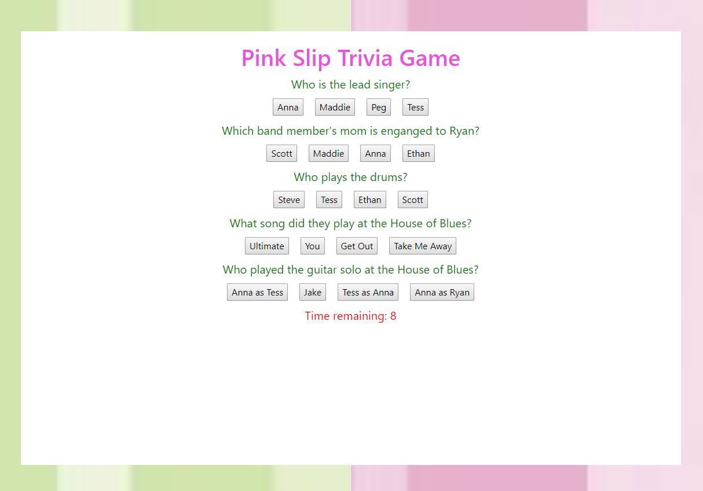

# Trivia Game: Pink Slip

## Summary
This is my trivia game created using javascript and jquery. This browser presents the user with five questions with four answer choices each at the start of the game. Once the game has ended, it displays the user's results and gives the option to restart the game. 

## Site Pictures


## Technologies Used 
- HTML - Used to create elements on the DOM
- JS - Used to manipulate content on HTML
- JQuery - JavaScript library used for DOM manipulation
- Git - Version control system to track changes to source code
- Github - Hosts repository that can be deployed to GitHub pages

## Code Snippet
The following code shows the function used to time the game. The timer is displayed when the game starts. When it reaches 0, the endGame function is called.
```js
function startTimer() {

    timer = 10;
    clearInterval(intervalId);
    intervalId = setInterval(decrement, 1000);

  }

  function decrement() {

    timer--;
    $("#timer").show();
    $("#timer").html("Time remaining: " + timer);

    if (timer <= 0) {
      endGame();
    }

  }
```

## Author Links
https://github.com/hagoodj